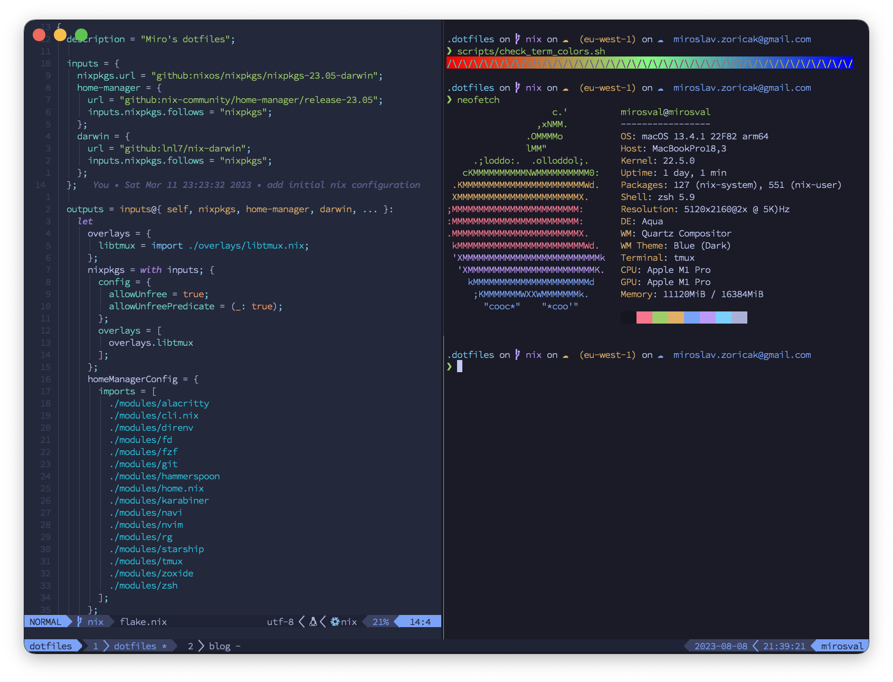

# Dotfiles



My dotfiles are optimized to use the mouse as little as possible and to make navigating the terminal as pleasant as possible on macOS. Relying on Nix, the philosophy is to only have "general" tools installed machine-wide and install project-specific tools using that project's flake.

Highlights:

* [Nix](https://nixos.org/), [nix-darwin](https://github.com/LnL7/nix-darwin) and [home-manager](https://github.com/nix-community/home-manager)
* [Alacritty](https://github.com/jwilm/alacritty)
* ~~[Hasklig](https://github.com/ryanoasis/nerd-fonts/tree/master/patched-fonts/Hasklig)~~
* [Monaspace Ne](https://github.com/ryanoasis/nerd-fonts/tree/master/patched-fonts/Monaspace)
* Tmux + Neovim integration (navigate using `ctrl-hjkl` between tmux/nvim panels)
* [Karabiner](https://pqrs.org/osx/karabiner/) and [Hammerspoon](https://www.hammerspoon.org/) (map `caps-lock` to `esc`, move/resize windows, quick shortcuts)

## Contents

* Installation
* Usage

## Installation

```shell
make install
make darwin-switch
```

## Usage

### Tmux

To start a tmux session:

```shell
tl dot
```

`tl` is an alias for tmuxp load (defined in `modules/zsh/aliases.nix`), `dot` stands for dotfiles session config file located at `modules/tmux/tmuxp/dot.yaml`.

Use `Prefix+s` to switch between running sessions using fzf.

- `ctrl-b c` to create a new tab
- `ctrl-b -` to split vertically
- `ctrl-b |` to split horizontally
- `ctrl-b x` to close a panel
- `ctrl-b ,` to rename a tab
- `ctrl-b C` to clear the screen
- `ctrl-k/j/k/l` to navigate between panels (also works with neovim)
- `ctrl-b 1/2/3...` to switch to a different tab

### Neovim

I use neovim built in LSP for talking to the LSP Servers.

- `ctrl-k/j/k/l` to navigate between panels
- `\a` LSP Code Action
- `\w` save
- `\ew` open current directory viewer
- `\es` open current directory viewer in vertical split
- `\ev` open current directory viewer in horizontal split
- `\;` open LanguageClient context menu
- `K` LanguageClient Hover
- `gd` LanguageClient Go to definition
- LanguageClient formats on save
- `ctrl-p` to trigger fuzzy finder

### Hammerspoon

Used for window management, caffeine replacement (prevents machine going to sleep), etc.

- `caps-lock-a` Alacritty
- `caps-lock-b` Firefox
- `caps-lock-c` Calendar
- `caps-lock-d` Spotify
- `caps-lock-e` IntelliJ IDEA
- `caps-lock-g` Fork
- `caps-lock-m` Messages
- `caps-lock-m` Google Chrome
- `caps-lock-s` Slack
- `caps-lock-t` DataGrip
- `caps-lock-v` Visual Studio Code
- `caps-lock-h` Move window to the left
- `caps-lock-j` Move window to the bottom
- `caps-lock-k` Move window to the top
- `caps-lock-l` Move window to the right
- `caps-lock-f` Maximize window, repeat to cycle through sizes
- `caps-lock-y` Move window one screen west
- `caps-lock-u` Move window one screen south
- `caps-lock-i` Move window one screen north
- `caps-lock-o` Move window one screen east

### Karabiner

- Remap `caps-lock` to `esc` when pressed shortly and to `hyper` when long-pressed.

Troubleshooting:

When  you get messages like:

```text
[2023-08-07 22:07:41.565] [error] [console_user_server] grabber_client connect_failed: Connection refused
```

and you have checked that the relevant Input Monitoring options in the Settings are turned on, try: 
```shell
/Applications/.Nix-Karabiner/.Karabiner-VirtualHIDDevice-Manager.app/Contents/MacOS/Karabiner-VirtualHIDDevice-Manager deactivate
/Applications/.Nix-Karabiner/.Karabiner-VirtualHIDDevice-Manager.app/Contents/MacOS/Karabiner-VirtualHIDDevice-Manager activate
```

this should re-request the approval of the virtual keyboard device.

### Notable utils

I use Rust re-implementations of many standard utilities.

- [bat](https://github.com/sharkdp/bat) like `cat` but prettier
- [eza](https://github.com/eza-community/eza) replacement for `ls`
- [fd](https://github.com/sharkdp/fd) replacement for `find`
- [procs](https://github.com/dalance/procs) replacement for `ps`
- [ripgrep](https://github.com/BurntSushi/ripgrep) replacement for `ag`
- [sd](https://github.com/chmln/sd) replacement for `sed`
- [tokei](https://github.com/XAMPPRocky/tokei) for counting lines of code
- [xsv](https://github.com/BurntSushi/xsv) csv manipulation similar to jq

Other interesting tools:

- [navi](https://github.com/denisidoro/navi) ctrl-r triggers parametric cheat sheet search (defined in `modules/navi/cheats/common.cheat`)
